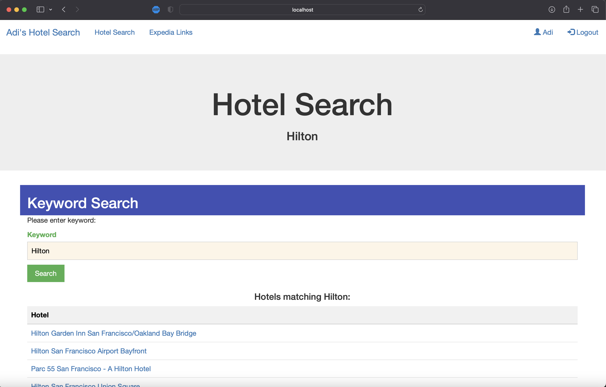
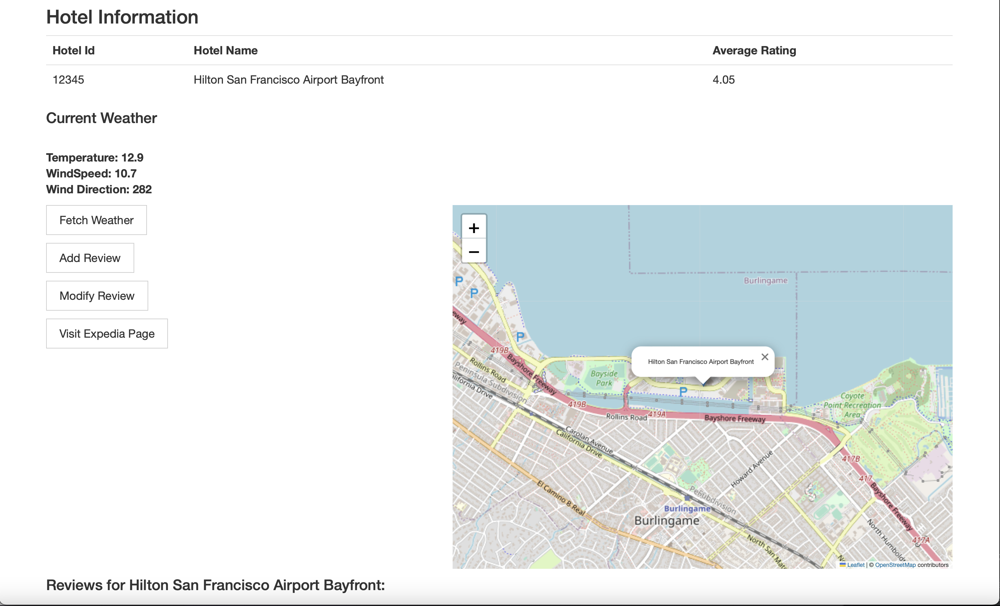
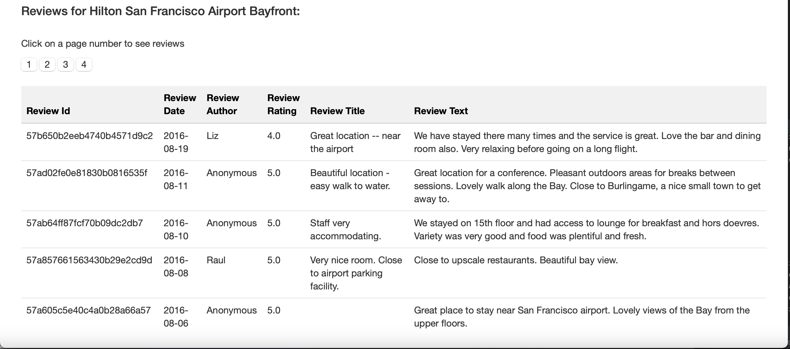
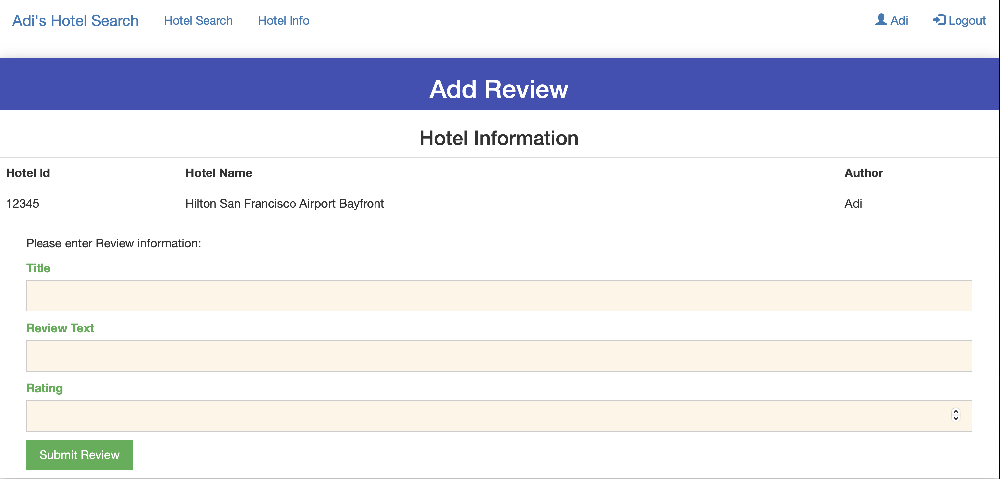
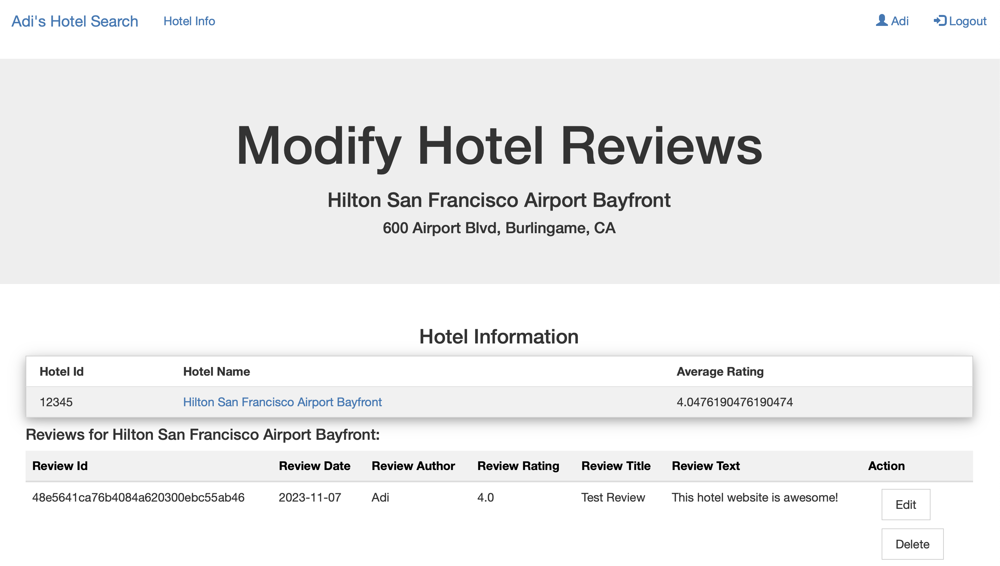

# Hotels.com Clone
The goal of this project is to implement a website with a subset of the functionality of hotels.com, where users can register, login, search for hotels, read reviews written by other people, write and edit their own reviews, etc.

## Features

- Includes a front end and a back end. 
- Jetty/servlets to serve webpages. 
- Connects to a MySQL database to read, write, update, and delete data.  
- Web pages use Twitter Bootstrap, and dynamically load webpage elements such as maps location and real-time weather.

## Run
To start the **backend server**:

Run `HotelServer.java main()` located in Hotels.com-Clone/src/main/java/hotelapp/HotelSever. 
By default, the server serves at localhost:8080.

You will need to connect to a MySQL database. Make sure the username, password, hostname, and database name in database.properties is correct.

To start the **frontend**:

Once the backend server is up and running, go to `localhost:8080/home`

## Screenshots

### Hotel Search
Current logged in user is displayed in the nav bar, as well as options to logout. 
Searching for 'Hilton':

### Hotel Info
Information regarding the selected Hotel from the prior search.  
The hotel name, average rating, location on a map, and local weather are shown.

### Hotel Reviews
On the Hotel Info page, åll reviews for the current Hotel are available. Paginated to 10 per page for better viewing. Only the table holding the reviews is dynamically updated when navigating to the next reviews page.

### Add/Modify Review
Once a user is logged in, they can add a review for a particular Hotel. They can then edit or delete the review. Users can only edit or delete reviews authored by them.

